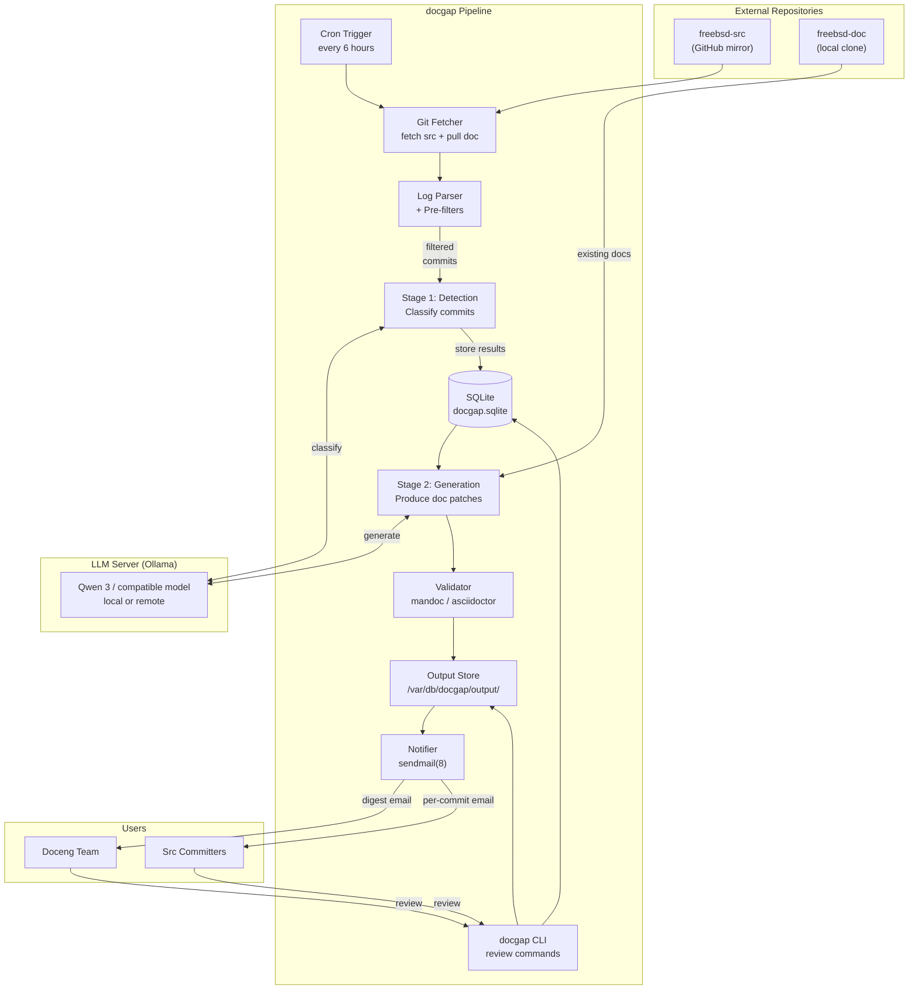
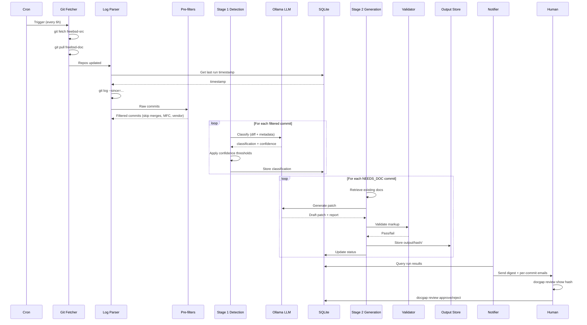
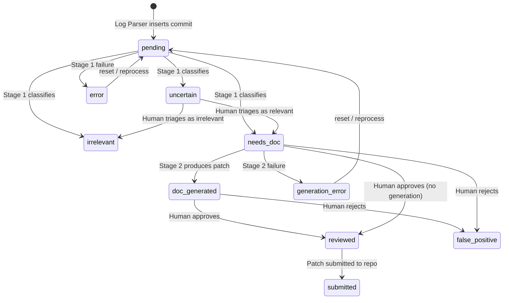

# Product Requirements Document: docgap

**Title:** FreeBSD Documentation Gap Detector (docgap)
**Version:** 1.0
**Date:** April 6, 2026
**Author:** Edson Brandi <ebrandi@FreeBSD.org>
**Status:** Implemented
**Repository:** https://github.com/ebrandi/docgap

---

## 1. Executive Summary

docgap is a batch-processing pipeline that monitors the FreeBSD source repository (freebsd-src) for commits that introduce user-visible changes, evaluates those changes against the current official documentation, identifies documentation gaps, and produces draft documentation patches conforming to FreeBSD Documentation Project Primer (FDP Primer) standards. All output requires human review before submission, with a feature flag for future autonomous operation.

The system operates entirely on local infrastructure using a GMKtec EVO-X2 workstation with 96 GB of unified VRAM, running Ollama with Qwen 3 models for inference. It processes commits in 6-hour batches via cron, classifies each commit through a two-stage LLM pipeline (detection then generation), and delivers results via email notifications and a CLI review interface. The architecture is deliberately simple: cron for scheduling, SQLite for state, sendmail for notifications, and Python with Click for the CLI.

docgap addresses a long-standing operational gap in the FreeBSD project where documentation updates depend entirely on developer self-reporting. By automating the detection of documentation-relevant commits and producing standards-compliant draft patches, the system reduces the time-to-detection from months to hours and gives committers an easy path to documentation -- reviewing a draft rather than writing from scratch.

---

## 2. Problem Statement

FreeBSD's documentation quality depends on developers self-reporting when their commits require documentation updates. In practice, most developers do not enjoy writing documentation and rarely flag the need. The Doceng team typically discovers documentation gaps only when end users file problem reports -- sometimes months or years after the code change landed. This damages the project's reputation for having excellent, comprehensive documentation.

There is currently no automated mechanism to detect when a source commit introduces user-visible changes that are not reflected in the existing documentation. The gap between code and documentation grows silently.

This problem is now tractable because:

- AI models have reached sufficient capability to analyze code diffs and cross-reference them against documentation corpora
- Hardware capable of running large-context local models (96 GB VRAM) is available within the project's infrastructure
- FreeBSD's commit culture of atomic commits (one change per commit) makes automated analysis significantly more tractable than it would be in other projects

---

## 3. Goals and Objectives

| # | Goal | Measurable Target |
|---|------|-------------------|
| G1 | Detect documentation-relevant commits automatically | >= 80% recall for commits genuinely requiring documentation updates |
| G2 | Maintain low false positive rate | False positive rate below 15% of flagged commits |
| G3 | Reduce time-to-detection | Documentation gaps identified within 48 hours of commit landing |
| G4 | Drive Doceng adoption | At least 3 Doceng members actively using reports within 3 months |
| G5 | Increase documentation throughput | At least 5 documentation PRs per quarter initiated from system output |
| G6 | Engage committers in documentation | At least 20% of flagged committers review proposed documentation |
| G7 | Maintain human oversight | Zero AI-generated documentation committed without human review in v1 |

---

## 4. Target Users

### Primary Users

**FreeBSD Doceng Team Members**
- Responsible for ensuring documentation completeness and accuracy
- Receive aggregate digest emails summarizing each pipeline run
- Use the CLI to triage uncertain commits and review generated patches
- Approve or reject generated documentation via `docgap review` commands

**FreeBSD src Committers**
- Receive per-commit email notifications when their changes are flagged
- Review proposed documentation for their own code changes
- Provide feedback via `docgap review approve` or `docgap review reject --reason`

### Secondary Users

**FreeBSD Documentation Contributors**
- Use system reports to find meaningful documentation work to contribute
- Review generated drafts as starting points for manual documentation efforts

**FreeBSD Release Engineering**
- Benefit from documentation being current at release time
- Can query the system for outstanding documentation gaps before a release

---

## 5. Core Value Proposition

**Automatically detect when FreeBSD source commits create documentation gaps, eliminating the silent accumulation of undocumented features and behavioral changes.**

Supporting value points:

- Replaces a broken process that depends entirely on developer self-reporting
- Catches documentation gaps at commit time rather than months later via user complaints
- Gives committers an easy path to documentation -- review a draft rather than write from scratch
- Produces FDP Primer-compliant output that can be submitted with minimal editing
- Protects FreeBSD's reputation for comprehensive, accurate documentation
- Operates entirely on local infrastructure with no external API dependencies

---

## 6. Product Overview

docgap is a two-stage pipeline that runs as a cron job every 6 hours on dedicated hardware:

**Stage 1 -- Detection:** For each new commit since the last run, the system fetches the full diff and sends it to a local LLM with a classification prompt. The LLM classifies the commit as `NEEDS_DOC`, `IRRELEVANT`, or `UNCERTAIN`, with a confidence score, category, and reasoning. Confidence thresholds are applied: commits with confidence >= 0.80 are accepted as-is, 0.50-0.80 are overridden to `UNCERTAIN`, and below 0.50 are overridden to `IRRELEVANT`.

**Stage 2 -- Generation:** For commits classified as `NEEDS_DOC`, the system retrieves the relevant existing documentation (via path-based mapping with keyword fallback), loads the FDP Primer conventions, and sends the combined context to the LLM to produce a draft documentation patch. The patch is validated with mandoc(1) or asciidoctor, stored on disk, and the commit status is updated to `doc_generated`.

Results are persisted in SQLite, output artifacts are stored in a structured directory, email notifications are sent to Doceng and committers, and the CLI provides a complete review workflow.

---

## 7. Functional Requirements

### FR-1xx: Git Ingestion and Parsing

| ID | Requirement | Implementation |
|----|-------------|----------------|
| FR-101 | Maintain a local clone of freebsd-src (fetch-only, no working tree modifications) | `GitFetcher` with `bare=True`, runs `git fetch --all --prune` |
| FR-102 | Maintain a local clone of freebsd-doc (working tree for documentation lookups) | `GitFetcher` with `bare=False`, runs `git pull --ff-only` |
| FR-103 | Extract commits since the last successful run using `git log --since` | `LogParser.parse_and_filter()` queries the `runs` table for `finished_at` |
| FR-104 | Parse commit metadata: hash, author, email, date, subject, files changed | `LogParser` uses `--format='%H|%an|%ae|%aI|%s'` with `--name-only` |
| FR-105 | Pre-filter commits that are definitively not documentation-relevant | Skip merge commits (`^Merge `), MFC/MFS commits, reverts, vendor imports (`contrib/`, `sys/contrib/`), bot commits, and commits touching only Makefile, .gitignore, UPDATING, ObsoleteFiles.inc |
| FR-106 | Support configurable branch monitoring | `repositories.freebsd_src.branches` list in config, default: `[main]` |
| FR-107 | On first run with no prior history, process the last 7 days of commits | `PipelineRunner.run_pipeline()` defaults to `timedelta(days=7)` |

### FR-2xx: Stage 1 Detection (LLM Classification)

| ID | Requirement | Implementation |
|----|-------------|----------------|
| FR-201 | Classify each commit as `NEEDS_DOC`, `IRRELEVANT`, or `UNCERTAIN` | `Stage1Detector.classify()` sends diff + metadata to Ollama |
| FR-202 | Return a confidence score (0.0-1.0) with each classification | LLM JSON response includes `confidence` field |
| FR-203 | Identify the change category: `new_flag`, `new_command`, `changed_default`, `new_syscall`, `new_sysctl`, `changed_output`, `new_ioctl`, `api_change`, `other` | `Category` enum in `docgap.core.classification` |
| FR-204 | Identify the documentation target (manpage path or handbook section) | `doc_target` field in classification result |
| FR-205 | Provide human-readable reasoning for each classification | `reasoning` field stored in SQLite |
| FR-206 | Apply confidence thresholds: >= 0.80 accept, 0.50-0.80 override to UNCERTAIN, < 0.50 override to IRRELEVANT | `ClassificationResult.apply_thresholds()` |
| FR-207 | Fetch the full diff for each commit via `git diff <hash>^..<hash>` | `GitFetcher.get_diff()` called by `Stage1Detector` |
| FR-208 | Enforce input size limits to prevent resource exhaustion | `MAX_DIFF_LENGTH = 100,000` chars, `MAX_FILES_PER_COMMIT = 500` |

### FR-3xx: Stage 2 Generation (Documentation Patches)

| ID | Requirement | Implementation |
|----|-------------|----------------|
| FR-301 | Generate draft documentation patches for commits classified as `NEEDS_DOC` | `Stage2Generator.generate()` produces `GenerationResult` |
| FR-302 | Produce patches in mdoc(7) format for manpages | Format determined by `doc_target` path extension |
| FR-303 | Produce patches in AsciiDoc format for handbook/books | Extensions `.adoc`, `.asciidoc` trigger AsciiDoc mode |
| FR-304 | Include FDP Primer conventions in the generation prompt | Loaded via `load_prompt()` from prompt templates |
| FR-305 | Validate generated mdoc output with `mandoc -Tlint` when enabled | `DocValidator.validate()` with `config.generation.validate_mdoc` |
| FR-306 | Validate generated AsciiDoc output with `asciidoctor --safe` when enabled | `DocValidator.validate()` with `config.generation.validate_asciidoc` |
| FR-307 | Retry generation once if validation fails | `config.generation.max_retries = 1` |
| FR-308 | Produce a human-readable report alongside each patch | `GenerationResult.report` field |
| FR-309 | Store output artifacts in structured directories | `/var/db/docgap/output/<commit-hash>/` with `report.txt`, `manpage.patch`, `handbook.patch`, `metadata.json` |
| FR-310 | Track generation duration for observability | `GenerationResult.duration_ms` field |
| FR-311 | Enforce doc content size limits | `MAX_DOC_CONTENT_LENGTH = 50,000` chars |
| FR-312 | Allow generation to be disabled via configuration | `config.generation.enabled` flag |

### FR-4xx: Documentation Retrieval (Path Mapping + Keyword Fallback)

| ID | Requirement | Implementation |
|----|-------------|----------------|
| FR-401 | Map source file paths to documentation files using deterministic rules | `PathMapper.map_path()` in `docgap.core.mappings` |
| FR-402 | Support path mappings for all FreeBSD source tree conventions | `usr.bin/{cmd}/ -> {cmd}.1`, `usr.sbin/{cmd}/ -> {cmd}.8`, `sbin/{cmd}/ -> {cmd}.8`, `bin/{cmd}/ -> {cmd}.1`, `lib/lib{name}/ -> *.3`, `sys/kern/ -> man9`, `sys/net/ -> man4`, `sys/dev/{driver}/ -> {driver}.4`, `sys/sys/*.h -> man2` |
| FR-403 | Fall back to keyword search when path mapping yields no results | `DocRetriever._search_docs()` uses `KeywordSearch` |
| FR-404 | Index documentation files from the doc repository for keyword matching | `DocRetriever._index_default_docs()` indexes up to 500 files by filename and first 500 chars |
| FR-405 | Cache retrieved documentation to avoid redundant disk reads | `DocRetriever._cache` dictionary keyed by doc path |
| FR-406 | Detect documentation format (mdoc vs AsciiDoc) from file extension | `DocRetriever._format_from_path()` checks `.1-.9` for mdoc, `.adoc/.asciidoc` for AsciiDoc |
| FR-407 | Retrieve documentation content at a specific commit | `GitFetcher.get_file_content_at_commit()` |

### FR-5xx: State Persistence (SQLite)

| ID | Requirement | Implementation |
|----|-------------|----------------|
| FR-501 | Store all state in a single SQLite database file | Default path: `/var/db/docgap/docgap.sqlite` |
| FR-502 | Track pipeline runs with status, timestamps, and commit counts | `runs` table: `id`, `started_at`, `finished_at`, `status`, `commits_processed`, `commits_flagged`, `error_message` |
| FR-503 | Track commit analysis results with full classification metadata | `commits` table: `hash` (unique), `run_id`, `author`, `email`, `date`, `subject`, `files` (JSON), `status`, `classification`, `confidence`, `category`, `doc_target`, `reasoning`, `reviewer`, `reviewed_at`, `feedback` |
| FR-504 | Track sent notifications | `notifications` table: `id`, `run_id`, `commit_hash`, `recipient`, `notification_type`, `sent_at`, `status`, `error_message` |
| FR-505 | Support schema versioning and upgrades | `SCHEMA_VERSION = 3`, `get_schema_upgrade_sql()` handles v1->v2 and v2->v3 migrations; v3 adds `retry_count` column |
| FR-506 | Provide indexed queries on commit status, hash, date, and run status | Indices: `idx_commits_hash`, `idx_commits_status`, `idx_commits_run_id`, `idx_runs_status`, `idx_notifications_status`, `idx_notifications_commit_hash` |
| FR-507 | Initialize database and directories via `docgap init` | `init_database()` creates tables; `init_command()` creates `output/`, `repos/` directories |
| FR-508 | Enable foreign key constraints | `PRAGMA foreign_keys = ON` in schema |

### FR-6xx: CLI Interface

| ID | Requirement | Implementation |
|----|-------------|----------------|
| FR-601 | Provide a `docgap` CLI entry point using Click | `@click.group()` in `docgap.cli.main` |
| FR-602 | `docgap run [--since TIMESTAMP] [--dry-run]` -- execute the full pipeline | `run_pipeline()` in commands; `--dry-run` skips persistence and notifications |
| FR-603 | `docgap status` -- show pipeline health and last run statistics | Displays last run info, commit status counts, output directory stats, LLM connection health |
| FR-604 | `docgap log [--since DATE] [--status STATUS]` -- query analyzed commits | Filters by date and status, displays up to 50 commits |
| FR-605 | `docgap review list` -- list commits needing review | Shows commits with status `needs_doc` or `doc_generated` |
| FR-606 | `docgap review show <hash>` -- display report and patch for a commit | Shows classification, confidence, category, reasoning, report text, and patch content |
| FR-607 | `docgap review approve <hash> [--reviewer NAME]` -- approve a commit | Transitions status to `reviewed`, records reviewer and timestamp |
| FR-608 | `docgap review approve --all [--since TIMESTAMP] [--reviewer NAME]` -- bulk approve | `review_approve_bulk()` approves all commits in `needs_doc` or `doc_generated` status |
| FR-609 | `docgap review reject <hash> [--reason TEXT] [--reviewer NAME]` -- reject a commit | Transitions status to `false_positive`, records reason as feedback |
| FR-610 | `docgap init` -- initialize database and directories | Creates data directories and runs `init_database()` |
| FR-611 | `docgap report [--format txt\|json] [--save] [--output PATH]` -- generate detailed report | Outputs commit statistics, last run info, detailed commit listings (needs_doc, doc_generated, uncertain, errors) with per-commit metadata, output file listings, and report previews. Data sourced from both SQLite and output directory. --save writes to {data_dir}/reports/, --output writes to specific path |
| FR-612 | `docgap config show` -- display current configuration | Iterates all config sections and prints key-value pairs |
| FR-613 | `docgap --version` -- display version | `@click.version_option()` with `__version__` |
| FR-614 | `docgap -c/--config PATH` -- specify configuration file path | Global option, default: `config/config.yaml` |
| FR-615 | `docgap -v/--verbose` -- enable debug logging | Sets logging level to `DEBUG` |
| FR-616 | State machine enforcement on review transitions | Approve requires `needs_doc` or `doc_generated`; reject requires `needs_doc`, `doc_generated`, or `uncertain` |

### FR-7xx: Notification System (Email)

| ID | Requirement | Implementation |
|----|-------------|----------------|
| FR-701 | Send digest emails to Doceng team after each run with findings | `Notifier.send_digest()` via `PipelineRunner._send_notifications()` |
| FR-702 | Send per-commit emails to individual committers for flagged changes | `Notifier.send_per_commit()` for each `needs_doc` commit |
| FR-703 | Use sendmail(8) on localhost for email delivery | `config.notification.smtp_host = localhost` |
| FR-704 | Only send digests when there are findings | `config.notification.digest_only_if_findings = true` |
| FR-705 | Track notification delivery in the database | `notifications` table with `status` and `error_message` fields |
| FR-706 | Support enabling/disabling notifications globally | `config.notification.enabled` flag |
| FR-707 | Support enabling/disabling per-committer notifications | `config.notification.committer_notify` flag |
| FR-708 | Configurable sender address and recipient list | `config.notification.from_address`, `config.notification.doceng_recipients` |

### FR-8xx: Human Review Gate

| ID | Requirement | Implementation |
|----|-------------|----------------|
| FR-801 | All generated patches require explicit human approval before submission | Default: `config.review.auto_submit.enabled = false` |
| FR-802 | Feature flag for autonomous submission, disabled by default | `review.auto_submit.enabled` in config.yaml |
| FR-803 | Per-category granular control for autonomous mode | `review.auto_submit.categories` with boolean flags for each category |
| FR-804 | Configurable hold period before auto-submission | `review.auto_submit.hold_period_hours = 72` (veto window) |
| FR-805 | Auditable approval trail with reviewer identity and timestamp | `reviewer`, `reviewed_at` columns in `commits` table |
| FR-806 | Feedback capture on rejections | `feedback` column stores free-text rejection reasons |

### FR-9xx: Configuration System

| ID | Requirement | Implementation |
|----|-------------|----------------|
| FR-901 | YAML-based configuration file | `config/config.yaml`, loaded by `docgap.config.load_config()` |
| FR-902 | Typed configuration with dataclass schema | `Config` dataclass in `docgap.config.schema` |
| FR-903 | Environment variable overrides | `DOCGAP_GENERAL_DATA_DIR`, `DOCGAP_LLM_BASE_URL`, `DOCGAP_LLM_MODEL` |
| FR-904 | Sample configuration file for reference | `config/config.yaml.sample` |
| FR-905 | Configuration sections: general, repositories, llm, detection, generation, review, notification, debug | All sections implemented with typed defaults |

### FR-10xx: Operational (Cron, rc.d, Install/Upgrade/Uninstall)

| ID | Requirement | Implementation |
|----|-------------|----------------|
| FR-1001 | Cron job running every 6 hours | `scripts/cron.d/docgap`, runs `docgap run` at `0 */6 * * *` |
| FR-1002 | rc.d service script for FreeBSD | `scripts/rc.d/docgap`, enables via `docgap_enable="YES"` in `/etc/rc.conf` |
| FR-1003 | Installation script with configurable user, data dir, and config dir | `scripts/install.sh` with `--user`, `--data-dir`, `--config-dir` options |
| FR-1004 | Python package installable via pip | `pip install -e .` or `pip install -e ".[test]"` |
| FR-1005 | Cron mode with proper exit codes | `PipelineRunner.run_cron_mode()`: 0=success, 1=partial, 2=failure |
| FR-1006 | Pipeline self-healing on cron failures | Next cron run picks up unprocessed commits automatically via `--since` from last successful run |
| FR-1007 | Structured log output per run | Logs to `/var/db/docgap/logs/` |

### FR-11xx: Resilience and Self-Healing

| ID | Requirement | Implementation |
|----|-------------|----------------|
| FR-1101 | `docgap reprocess <hash>` -- reprocess a specific commit through both stages | `ReprocessRunner.reprocess_commit()` in `docgap.orchestrator.reprocessor` |
| FR-1102 | `docgap reprocess --failed` -- retry all error/generation_error commits | `ReprocessRunner.reprocess_by_status(["error", "generation_error"])` |
| FR-1103 | `docgap reprocess --pending` -- retry needs_doc commits without output | `ReprocessRunner.reprocess_by_status(["needs_doc"])` |
| FR-1104 | `docgap reprocess --stage1 <hash>` / `--stage2 <hash>` -- reprocess individual stages | Stage parameter in `reprocess_commit()` |
| FR-1105 | `docgap reprocess --since TIMESTAMP` -- reprocess commits by date range | `ReprocessRunner.reprocess_since()` |
| FR-1106 | `docgap heal` -- detect stale runs and stuck commits | `ReprocessRunner.heal()` checks for stale runs (>24h), incomplete Stage 2, retryable errors |
| FR-1107 | `docgap heal --fix` -- auto-repair detected issues | Marks stale runs as failed, reprocesses stuck commits |
| FR-1108 | `docgap validate` -- check system integrity | Checks config, database, repos, LLM connectivity, data directory permissions |
| FR-1109 | `docgap reset <hash>` -- reset commit to pending | Clears classification, increments retry_count, removes output directory |
| FR-1110 | `docgap purge --before DATE` -- clean old data | Deletes commits older than date, optionally removes output directories |
| FR-1111 | Track retry count per commit to prevent infinite loops | `retry_count` column in commits table (schema v3) |
| FR-1112 | Create audit run records for reprocess operations | Run records with `status='reprocess'` for traceability |

### FR-12xx: LLM Debug Logging

| ID | Requirement | Implementation |
|----|-------------|----------------|
| FR-1201 | Optional capture of LLM prompts and responses to disk | `LLMDebugLogger` in `docgap.llm.debug_logger`, enabled via `debug.llm_logging` |
| FR-1202 | Organize debug output by commit hash | `{data_dir}/debug/{commit_hash}/` directory structure |
| FR-1203 | Sequential file naming to preserve pipeline order | Files named `01-stage1-detection-prompt.txt`, `02-stage1-detection-response.txt`, etc. |
| FR-1204 | Metadata capture for cross-model comparison | `metadata.json` with model name, pipeline version, timestamps, config snapshot |
| FR-1205 | Automatic rotation of old debug entries | `max_debug_entries` config, oldest entries rotated by mtime |
| FR-1206 | Versioned directories on commit re-run | Existing dir renamed to `{hash}.v{N}/` before fresh run |
| FR-1207 | Atomic file writes for crash safety | Uses temp file + `os.replace()` pattern |
| FR-1208 | Commit hash validation for path safety | Hex-only validation (7-64 chars) prevents path traversal |

---

## 8. Non-Functional Requirements

### Performance

| ID | Requirement | Target |
|----|-------------|--------|
| NFR-01 | Pipeline completion time for a typical batch (20-50 commits) | < 30 minutes |
| NFR-02 | Stage 1 classification per commit | < 60 seconds |
| NFR-03 | Stage 2 generation per commit | < 5 minutes |
| NFR-04 | Path-based documentation lookup | < 100 milliseconds |
| NFR-05 | Keyword fallback search | < 1 second |
| NFR-06 | CLI command response time (non-pipeline) | < 2 seconds |

### Security

| ID | Requirement | Implementation |
|----|-------------|----------------|
| NFR-07 | No secrets flow through the LLM pipeline | System reads public repositories only |
| NFR-08 | Local-only inference | No source code or documentation sent to external services |
| NFR-09 | SQLite file permissions restricted | `chmod 600 /var/db/docgap/docgap.sqlite` |
| NFR-10 | No write access to monitored repositories | System only reads freebsd-src and freebsd-doc; never pushes |
| NFR-11 | Input size limits to prevent resource exhaustion | `MAX_DIFF_LENGTH = 100,000`, `MAX_DOC_CONTENT_LENGTH = 50,000`, `MAX_FILES_PER_COMMIT = 500` |
| NFR-12 | Parameterized SQL queries | All database operations use parameterized queries to prevent SQL injection |

### Reliability

| ID | Requirement | Implementation |
|----|-------------|----------------|
| NFR-13 | Pipeline failures are self-healing | Next cron run resumes from last successful `finished_at` |
| NFR-14 | ACID transactions for state persistence | SQLite with WAL mode and foreign key constraints |
| NFR-15 | Graceful handling of LLM failures | Commits marked as `uncertain` on malformed responses; errors logged |
| NFR-16 | Graceful handling of network failures | Git fetch failures mark run as `failed`; next run retries |
| NFR-17 | Database backup via simple file copy | Single-file SQLite database |

### Maintainability

| ID | Requirement | Implementation |
|----|-------------|----------------|
| NFR-18 | Python 3.11+ with minimal external dependencies | `pyyaml`, `requests`, `click` only |
| NFR-19 | Comprehensive test suite | `pytest` with coverage reporting |
| NFR-20 | Typed configuration with dataclasses | `Config` schema with type hints |
| NFR-21 | Modular architecture with clear separation of concerns | Separate packages: `cli`, `core`, `db`, `git`, `llm`, `orchestrator`, `config` |
| NFR-22 | Schema versioning with migration support | `SCHEMA_VERSION` tracking with `get_schema_upgrade_sql()` |

---

## 9. System Architecture

The system architecture is documented in detail in `SYSTEM-DESIGN.md`. The following diagrams summarize the key aspects.

### High-Level Pipeline Architecture



### Data Flow Sequence



### Commit State Machine



### Directory Layout

```
/var/db/docgap/                        # Runtime data root
  docgap.sqlite                        # State database
  repos/                               # Local repository clones
    freebsd-src/                       # Bare clone (fetch only)
    freebsd-doc/                       # Working tree clone (pull)
  output/                              # Generated artifacts per commit
    <commit-hash>/
      report.txt                       # Human-readable analysis
      manpage.patch                    # mdoc patch (if applicable)
      handbook.patch                   # AsciiDoc patch (if applicable)
      metadata.json                    # Machine-readable metadata
  logs/                                # Pipeline execution logs
  debug/                               # LLM debug logs (optional)
    <commit-hash>/
      01-stage1-detection-prompt.txt
      02-stage1-detection-response.txt
      metadata.json

/usr/local/etc/docgap/                 # Configuration
  config.yaml                          # Main configuration file
```

---

## 10. Data Model

### runs Table

| Column | Type | Description |
|--------|------|-------------|
| `id` | INTEGER (PK, autoincrement) | Run identifier |
| `started_at` | TEXT (ISO 8601) | Pipeline start timestamp |
| `finished_at` | TEXT (ISO 8601, nullable) | Pipeline completion timestamp |
| `status` | TEXT | `running`, `completed`, or `failed` |
| `commits_processed` | INTEGER | Total commits analyzed in this run |
| `commits_flagged` | INTEGER | Commits classified as `needs_doc` |
| `error_message` | TEXT (nullable) | Error details if run failed |

### commits Table

| Column | Type | Description |
|--------|------|-------------|
| `id` | INTEGER (PK, autoincrement) | Internal row identifier |
| `run_id` | INTEGER (FK -> runs.id) | Which pipeline run processed this commit |
| `hash` | TEXT (unique) | Git commit hash |
| `author` | TEXT | Commit author name |
| `email` | TEXT | Commit author email |
| `date` | TEXT (ISO 8601) | Commit date |
| `subject` | TEXT | Commit message first line |
| `files` | TEXT | JSON array of changed file paths |
| `status` | TEXT | `pending`, `irrelevant`, `needs_doc`, `uncertain`, `doc_generated`, `reviewed`, `submitted`, `false_positive` |
| `classification` | TEXT | LLM classification result |
| `confidence` | REAL | Confidence score 0.0-1.0 |
| `category` | TEXT | Change category (e.g., `new_flag`, `new_command`) |
| `doc_target` | TEXT | Path to affected documentation file |
| `reasoning` | TEXT | LLM reasoning for classification |
| `reviewer` | TEXT | Who reviewed the commit |
| `reviewed_at` | TEXT (ISO 8601) | Review timestamp |
| `feedback` | TEXT | Free-text feedback from reviewer |
| `retry_count` | INTEGER | Number of times this commit has been reprocessed (default: 0) |
| `created_at` | TEXT (ISO 8601) | Row creation timestamp |
| `updated_at` | TEXT (ISO 8601) | Row last update timestamp |

### notifications Table

| Column | Type | Description |
|--------|------|-------------|
| `id` | INTEGER (PK, autoincrement) | Notification identifier |
| `run_id` | INTEGER (FK -> runs.id) | Associated pipeline run |
| `commit_hash` | TEXT | Associated commit (for per-commit notifications) |
| `recipient` | TEXT | Email recipient address |
| `notification_type` | TEXT | `digest` or `per_commit` |
| `sent_at` | TEXT (ISO 8601) | When the email was sent |
| `status` | TEXT | `pending`, `sent`, or `failed` |
| `error_message` | TEXT (nullable) | Delivery error details |

### Indices

- `idx_commits_hash` on `commits(hash)`
- `idx_commits_status` on `commits(status)`
- `idx_commits_run_id` on `commits(run_id)`
- `idx_runs_status` on `runs(status)`
- `idx_notifications_status` on `notifications(status)`
- `idx_notifications_commit_hash` on `notifications(commit_hash)`

---

## 11. User Interface -- CLI Command Reference

### Global Options

```
docgap [OPTIONS] COMMAND [ARGS]
  -c, --config PATH    Path to configuration file (default: config/config.yaml)
  -v, --verbose        Enable verbose/debug output
  --version            Show version and exit
  --help               Show help message and exit
```

### Commands

```
docgap init
    Initialize the database and output directories.

docgap run [--since TIMESTAMP] [--dry-run]
    Run the full detection and generation pipeline.
    --since, -s TIMESTAMP    Process commits since this ISO timestamp
    --dry-run                Analyze without storing results or sending notifications

docgap status
    Show system status and pipeline health.
    Displays: last run info, commit status counts, output directory stats, LLM health.

docgap log [--since DATE] [--status STATUS]
    Query commit logs.
    --since DATE             Filter commits since date
    --status STATUS          Filter by status (pending, needs_doc, irrelevant, etc.)

docgap review list
    List commits needing review (status: needs_doc or doc_generated).

docgap review show COMMIT_HASH
    Display report and patch for a specific commit.

docgap review approve COMMIT_HASH [--reviewer NAME]
    Approve a commit for documentation update.
    Requires status: needs_doc or doc_generated.

docgap review approve --all [--since TIMESTAMP] [--reviewer NAME]
    Bulk approve all pending reviews.

docgap review reject COMMIT_HASH [--reason TEXT] [--reviewer NAME]
    Reject a commit as not needing documentation.
    Requires status: needs_doc, doc_generated, or uncertain.

docgap report [--format txt|json] [--save] [--output PATH]
    Generate detailed documentation report.
    --format txt|json    Output format (default: txt)
    --save               Save to {data_dir}/reports/ with timestamped filename
    --output PATH        Save to specific file path
    Report includes: statistics, last run info, commits needing documentation
    (with category, confidence, doc_target, reasoning), generated documentation
    (with output files and report preview), uncertain commits, and errors.
    Data sourced from SQLite database and output directory files.

docgap config show
    Display all configuration sections with current values.

docgap reprocess [COMMIT_HASH] [--failed] [--pending] [--stage1 HASH] [--stage2 HASH] [--since TIMESTAMP] [--dry-run] [--max-retries N]
    Reprocess failed or incomplete commits.
    --failed             Retry all error/generation_error commits
    --pending            Retry needs_doc commits without generated output
    --stage1 HASH        Re-run only Stage 1 for HASH
    --stage2 HASH        Re-run only Stage 2 for HASH
    --since TIMESTAMP    Reprocess commits since timestamp
    --dry-run            Preview without changes
    --max-retries N      Max retry count (default: 3)

docgap heal [--fix] [--dry-run]
    Detect and repair pipeline issues.
    --fix                Auto-fix: mark stale runs, reprocess stuck commits
    --dry-run            Show what --fix would do

docgap validate
    Check system integrity (config, DB, repos, LLM, data directory).

docgap reset COMMIT_HASH [--confirm]
    Reset a commit to pending status.
    --confirm            Skip confirmation prompt

docgap purge --before TIMESTAMP [--status STATUS...] [--include-output] [--dry-run] [--confirm]
    Clean old data from the database.
    --before TIMESTAMP   Required: purge commits older than this date
    --status STATUS      Restrict to specific statuses (repeatable)
    --include-output     Also delete output directories
    --dry-run            Preview without changes
    --confirm            Skip confirmation prompt
```

---

## 12. Configuration Reference

### general

| Key | Type | Default | Description |
|-----|------|---------|-------------|
| `general.data_dir` | string | `/var/db/docgap` | Root directory for all runtime data |
| `general.log_level` | string | `info` | Logging level: `debug`, `info`, `warning`, `error` |

### repositories

| Key | Type | Default | Description |
|-----|------|---------|-------------|
| `repositories.freebsd_src.path` | string | `/var/db/docgap/repos/freebsd-src` | Local path to freebsd-src clone |
| `repositories.freebsd_src.remote` | string | `https://github.com/freebsd/freebsd-src.git` | Git remote URL for freebsd-src |
| `repositories.freebsd_src.branches` | list[string] | `[main]` | Branches to monitor |
| `repositories.freebsd_doc.path` | string | `/var/db/docgap/repos/freebsd-doc` | Local path to freebsd-doc clone |
| `repositories.freebsd_doc.remote` | string | `https://github.com/freebsd/freebsd-doc.git` | Git remote URL for freebsd-doc |

### llm

| Key | Type | Default | Description |
|-----|------|---------|-------------|
| `llm.provider` | string | `ollama` | LLM provider (only `ollama` supported) |
| `llm.base_url` | string | `http://localhost:11434` | Ollama server URL |
| `llm.model` | string | `qwen3-coder-next-512k` | Model name in Ollama |
| `llm.temperature` | float | `0.1` | Sampling temperature (low for deterministic output) |
| `llm.max_context` | integer | `524288` | Maximum context window in tokens (512k) |
| `llm.timeout` | integer | `120` | Request timeout in seconds |

### detection

| Key | Type | Default | Description |
|-----|------|---------|-------------|
| `detection.confidence_threshold_accept` | float | `0.80` | Minimum confidence to accept classification as-is |
| `detection.confidence_threshold_reject` | float | `0.50` | Below this confidence, override to IRRELEVANT |
| `detection.skip_patterns` | list[string] | `["^Merge ", "^MFC ", "^MFS ", "^Revert "]` | Regex patterns for commit subjects to skip |
| `detection.skip_paths` | list[string] | `["contrib/", "sys/contrib/", ".github/"]` | File path prefixes to skip entirely |
| `detection.skip_files` | list[string] | `["Makefile", ".gitignore", "UPDATING", "ObsoleteFiles.inc"]` | Specific filenames to skip |

### generation

| Key | Type | Default | Description |
|-----|------|---------|-------------|
| `generation.enabled` | boolean | `true` | Enable Stage 2 generation |
| `generation.validate_mdoc` | boolean | `true` | Validate generated mdoc with `mandoc -Tlint` |
| `generation.validate_asciidoc` | boolean | `true` | Validate generated AsciiDoc with asciidoctor |
| `generation.max_retries` | integer | `1` | Retry count if validation fails |

### review

| Key | Type | Default | Description |
|-----|------|---------|-------------|
| `review.auto_submit.enabled` | boolean | `false` | Master switch for autonomous submission |
| `review.auto_submit.hold_period_hours` | integer | `72` | Hours to wait before auto-submission (veto window) |
| `review.auto_submit.categories.new_flag` | boolean | `false` | Auto-submit for new command flags |
| `review.auto_submit.categories.new_command` | boolean | `false` | Auto-submit for new commands |
| `review.auto_submit.categories.changed_default` | boolean | `false` | Auto-submit for changed defaults |
| `review.auto_submit.categories.new_syscall` | boolean | `false` | Auto-submit for new syscalls |
| `review.auto_submit.categories.new_sysctl` | boolean | `false` | Auto-submit for new sysctl knobs |
| `review.auto_submit.categories.changed_output` | boolean | `false` | Auto-submit for changed output formats |
| `review.auto_submit.categories.new_ioctl` | boolean | `false` | Auto-submit for new ioctls |
| `review.auto_submit.categories.api_change` | boolean | `false` | Auto-submit for API changes |

### notification

| Key | Type | Default | Description |
|-----|------|---------|-------------|
| `notification.enabled` | boolean | `true` | Enable email notifications |
| `notification.doceng_recipients` | list[string] | `["doceng@FreeBSD.org"]` | Digest email recipients |
| `notification.committer_notify` | boolean | `true` | Send per-commit emails to authors |
| `notification.digest_only_if_findings` | boolean | `true` | Suppress empty digests |
| `notification.from_address` | string | `docgap@FreeBSD.org` | Sender email address |
| `notification.smtp_host` | string | `localhost` | SMTP server for sendmail |

### debug

| Key | Type | Default | Description |
|-----|------|---------|-------------|
| `debug.llm_logging` | boolean | `false` | Save LLM prompts and responses to disk |
| `debug.log_dir` | string | `{data_dir}/debug` | Directory for debug output |
| `debug.max_debug_entries` | integer | `500` | Max debug directories before rotation |
| `debug.include_config_snapshot` | boolean | `true` | Include detection/generation config in metadata.json |

### Environment Variable Overrides

| Variable | Overrides |
|----------|-----------|
| `DOCGAP_GENERAL_DATA_DIR` | `general.data_dir` |
| `DOCGAP_LLM_BASE_URL` | `llm.base_url` |
| `DOCGAP_LLM_MODEL` | `llm.model` |

---

## 13. Security Considerations

1. **No secrets in the pipeline.** The system reads public repositories and generates documentation. No credentials, API keys, or private data flow through the LLM.

2. **Local-only inference.** No source code or documentation is sent to external services. The LLM runs on the same machine via Ollama.

3. **No write access to repositories.** The system only reads freebsd-src and freebsd-doc. It never pushes to any repository. Patch submission is a manual human action.

4. **Input validation and size limits.** All inputs to the LLM are bounded: `MAX_DIFF_LENGTH = 100,000` characters, `MAX_DOC_CONTENT_LENGTH = 50,000` characters, `MAX_FILES_PER_COMMIT = 500` files. This prevents resource exhaustion from unusually large commits.

5. **SQL injection prevention.** All database operations use parameterized queries via Python's `sqlite3` module. No string interpolation in SQL.

6. **File permissions.** The SQLite database should be readable/writable only by the docgap service user: `chmod 600 /var/db/docgap/docgap.sqlite`.

7. **Email spoofing.** The `from_address` should be a real address that Doceng controls. SPF/DKIM should be configured if the machine sends to external recipients.

---

## 14. Deployment Requirements

### Hardware

| Component | Specification |
|-----------|---------------|
| Machine | GMKtec EVO-X2 |
| CPU | AMD Ryzen AI Max+ 395 (Strix Halo) |
| RAM | 128 GB |
| VRAM | 96 GB (unified memory) |
| Disk | 100+ GB free for repositories, database, and output |

### Software Dependencies

| Package | Purpose | Version |
|---------|---------|---------|
| Python | Runtime environment | 3.11+ |
| Ollama | Local LLM inference | Latest |
| Git | Repository management | 2.27+ |
| mandoc | mdoc markup validation | Latest (optional) |
| asciidoctor | AsciiDoc validation | Latest (optional) |
| sendmail | Email notifications | Native FreeBSD |

### Python Dependencies

| Package | Purpose |
|---------|---------|
| `pyyaml` | YAML configuration parsing |
| `requests` | Ollama HTTP API client |
| `click` | CLI framework |

### Target Platform

- **Primary:** FreeBSD 14.x+
- **Compatible:** FreeBSD 13+ with port updates
- **Development:** Linux systems with appropriate dependencies

### Installation

```bash
# Clone repository
git clone https://github.com/ebrandi/docgap.git
cd docgap

# Quick install (FreeBSD)
sudo ./scripts/install.sh

# Or manual install
pip install -e .
mkdir -p /var/db/docgap/{repos,output,reports,logs}
cp config/config.yaml.sample /usr/local/etc/docgap/config.yaml
docgap init
```

---

## 15. Success Criteria

| # | Criterion | Measurement Method | Target |
|---|-----------|-------------------|--------|
| SC-1 | Detection recall | Manual audit of 100 commits: flagged vs actually documentation-relevant | >= 80% |
| SC-2 | False positive rate | `commits WHERE status='false_positive'` / total flagged, 30-day rolling | < 15% |
| SC-3 | Time to detection | `commits.date` vs `commits.created_at` delta | < 48 hours |
| SC-4 | Doceng adoption | Count of distinct reviewers in `commits.reviewer` within 3 months | >= 3 members |
| SC-5 | Documentation throughput | Documentation PRs initiated from docgap output per quarter | >= 5 PRs |
| SC-6 | Committer engagement | Flagged commits with reviewer = committer / total flagged | >= 20% |
| SC-7 | Human review compliance | `commits WHERE status='submitted' AND reviewer IS NULL` | Zero (all reviewed) |

### Observability Metrics

| Metric | Source | Alert Threshold |
|--------|--------|-----------------|
| Last successful run timestamp | `runs` table | > 12 hours ago |
| Commits pending analysis | `commits WHERE status='pending'` | > 100 (backlog growing) |
| False positive rate (30-day) | `commits` table | > 15% of flagged |
| Average detection confidence | `AVG(confidence)` | < 0.70 (model degrading) |
| LLM inference time per commit | Run logs | > 5 minutes per commit |
| Disk usage in output/ | `du -sh` | > 10 GB |

---

## 16. Risks and Mitigations

| Risk | Likelihood | Impact | Mitigation |
|------|-----------|--------|------------|
| False positives erode committer trust and adoption | Medium | High | Optimize for precision over recall. Accept missing some gaps rather than flagging non-issues. Tune thresholds with feedback. |
| Generated documentation quality too low to be useful | Medium | Medium | Human review gate catches all output. Start with report-only mode. FDP Primer provided as explicit context. |
| Context window insufficient for complex commits + large manpages | Low | Medium | Retrieval strategy loads only relevant docs. Most commits are small and atomic. Input size limits enforced. |
| Model struggles with mdoc(7) markup accuracy | Medium | Medium | Extensive mdoc examples in prompt. mandoc(1) validation catches errors. Human review as final check. |
| Committers perceive system as nagging/bureaucracy | Medium | High | Launch as optional advisory tool. No enforcement. Committer gets first-review opportunity. |
| Subtle behavioral changes missed entirely | High | Low | Accepted trade-off. Catching 60-70% of obvious gaps is a massive improvement over 0% today. Improve patterns over time. |
| Hardware failure or VRAM constraints | Low | Medium | Single machine dependency. Monitor VRAM with `rocm-smi`. Consider cloud API fallback for critical periods. |
| Model quality regression in future versions | Low | Medium | Track average confidence over time. Alert if confidence drops below 0.70. Pin model versions. |
| Changes to FreeBSD git workflow or repo structure | Low | Medium | Path mapping rules are configuration, not code. Easy to update. |
| Community resistance to AI-generated documentation | Medium | Medium | Human-in-the-loop design. All output reviewed and edited by humans. System is advisory, not authoritative. |

---

## 17. Scope

### In Scope (v1)

- Monitor the freebsd-src repository (configurable branches, default: `main`)
- Analyze commits from a configurable time window (since last run or specified timestamp)
- Pattern-based detection of documentation-relevant changes via LLM classification
- Cross-reference against in-tree manpages (mdoc format) and freebsd-doc repository content (AsciiDoc)
- Structured gap reports with commit details, semantic change summaries, and confidence scores
- Draft documentation patches in mdoc(7) and AsciiDoc formats
- All output conforming to FDP Primer standards
- Email notifications to Doceng team and individual committers
- Human review gate with CLI-based approve/reject workflow
- Feature flag for future autonomous mode (disabled by default)
- SQLite state persistence with schema versioning
- Run locally on dedicated hardware (EVO-X2, 96 GB VRAM)
- Ollama with Qwen 3 models (512k context)
- Cron-based scheduling (every 6 hours)
- rc.d service integration for FreeBSD
- Installation and configuration scripts

### Out of Scope (v1)

- Monitoring the FreeBSD ports repository
- Monitoring the freebsd-doc repository itself for changes
- Translation of generated documentation
- Fully autonomous PR submission (v1 is human-in-the-loop only)
- Detection of subtle behavioral changes that do not match explicit patterns
- Web UI for managing the system (CLI is sufficient for v1)
- Integration with Bugzilla or other issue trackers
- Vector/embedding-based semantic search (RAG)
- IRC/Matrix bot notifications
- Multi-machine or distributed deployment

---

## 18. Future Roadmap

### v1.1 -- CI Integration and Bulk Operations

- Integration with FreeBSD CI/CD pipeline as an optional check
- Bulk operations: batch export of approved patches for submission
- Enhanced reporting: per-subsystem gap analysis, trend charts
- Configurable notification channels (IRC/Matrix bot)

### v1.2 -- Autonomous Mode Rollout

- Enable auto-submit for high-confidence, formulaic categories (e.g., new sysctl knobs)
- 72-hour hold period with veto capability
- Per-category trust calibration based on historical false positive rates

### v2.0 -- Expanded Coverage

- Automatic PR submission to freebsd-doc repository
- Release notes generation from accumulated documentation gaps
- Cross-project support (OpenBSD, NetBSD, DragonFly)
- Web dashboard for browsing reports and managing reviews
- Bugzilla integration for formal tracking of unresolved gaps
- Vector search as additional retrieval fallback

---

## 19. Glossary

| Term | Definition |
|------|------------|
| **AsciiDoc** | Lightweight markup language used by FreeBSD for the Handbook, FAQ, and other books/articles in the freebsd-doc repository |
| **Doceng** | FreeBSD Documentation Engineering team, responsible for documentation quality and infrastructure |
| **FDP Primer** | FreeBSD Documentation Project Primer -- the official style guide and reference for FreeBSD documentation contributors |
| **mdoc(7)** | The macro package used for FreeBSD manual pages (manpages), based on the groff/mandoc formatting system |
| **mandoc(1)** | A formatter and linter for mdoc(7) manual pages; used by docgap to validate generated manpage markup |
| **MFC** | Merge From Current -- a FreeBSD practice of merging changes from the `main` branch to stable branches |
| **MFS** | Merge From Stable -- the reverse of MFC |
| **Ollama** | A local LLM inference runtime that provides an HTTP API for running large language models on local hardware |
| **Qwen 3** | A family of large language models from Alibaba; docgap uses the coder variant with 512k context |
| **VRAM** | Video RAM; in the context of the EVO-X2 with its unified memory architecture, refers to the GPU-accessible memory pool used for LLM inference |
| **rc.d** | FreeBSD's service management framework, using shell scripts in `/usr/local/etc/rc.d/` |
| **sendmail(8)** | The default mail transfer agent (MTA) on FreeBSD systems |
| **Stage 1** | The detection phase of the docgap pipeline, which classifies commits |
| **Stage 2** | The generation phase of the docgap pipeline, which produces documentation patches |

---

## 20. References

1. **FreeBSD Documentation Project Primer (FDP Primer):** https://docs.freebsd.org/en/books/fdp-primer/book/
2. **mdoc(7) -- semantic markup language for manual pages:** https://man.freebsd.org/cgi/man.cgi?query=mdoc&sektion=7
3. **mandoc(1) -- format and display manual pages:** https://man.freebsd.org/cgi/man.cgi?query=mandoc&sektion=1
4. **FreeBSD Source Repository (GitHub mirror):** https://github.com/freebsd/freebsd-src
5. **FreeBSD Documentation Repository (GitHub mirror):** https://github.com/freebsd/freebsd-doc
6. **Ollama -- Run large language models locally:** https://ollama.com/
7. **docgap Project Repository:** https://github.com/ebrandi/docgap
8. **docgap System Architecture:** `SYSTEM-DESIGN.md`
