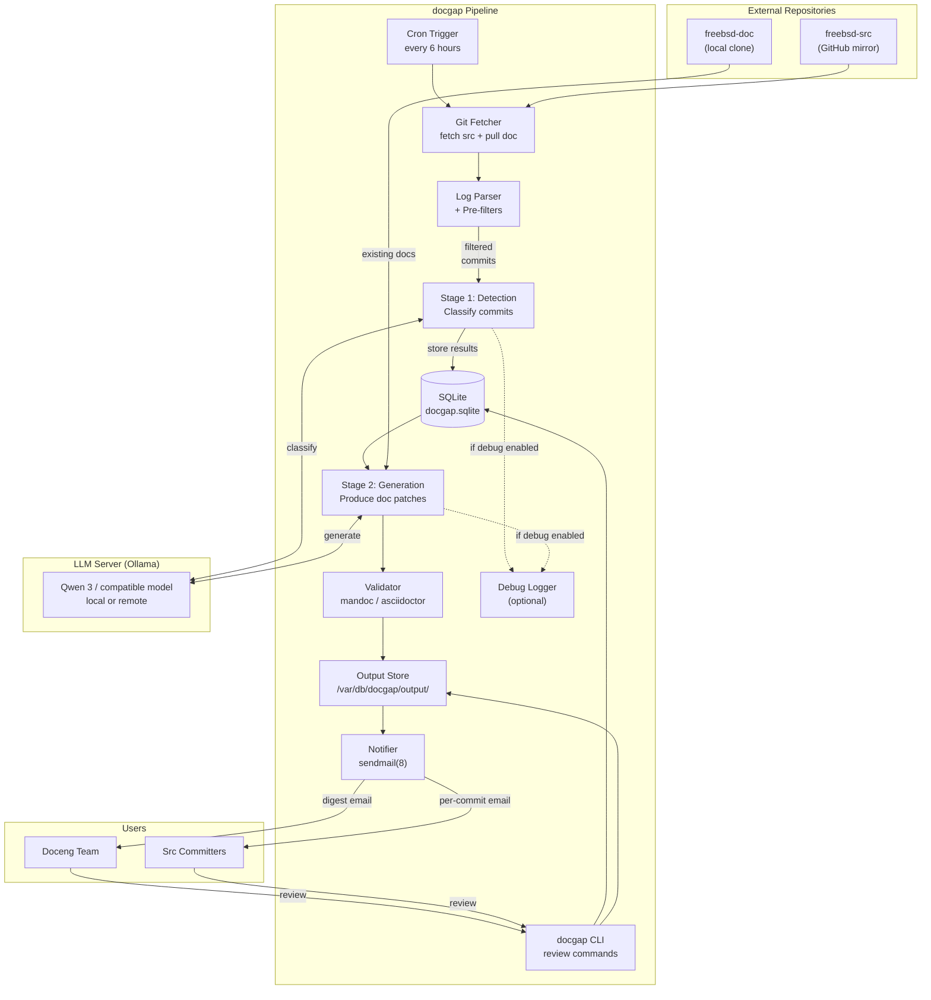
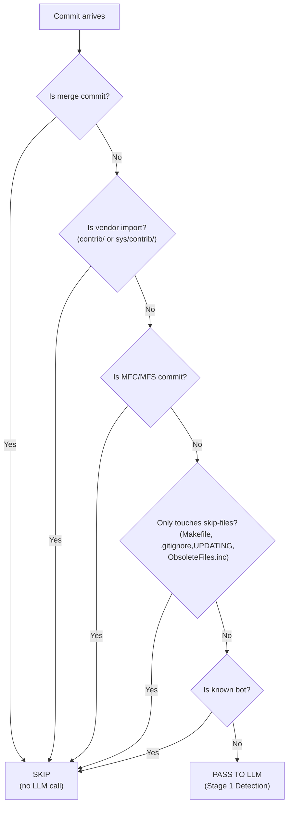
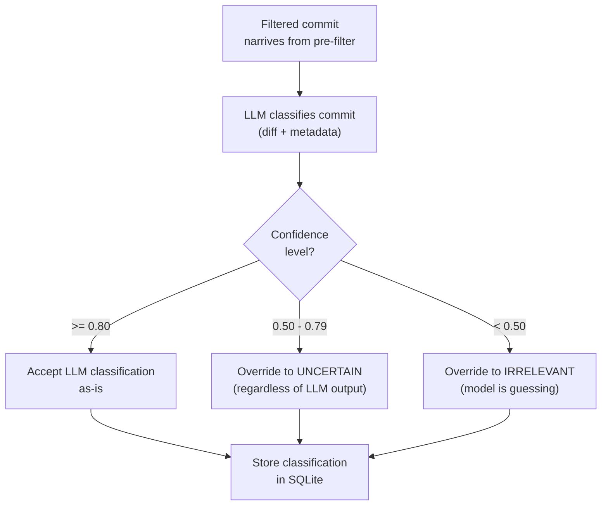
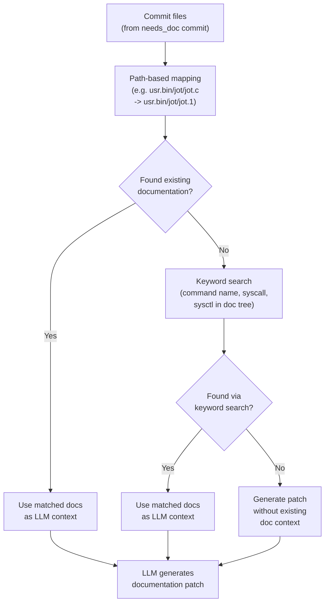
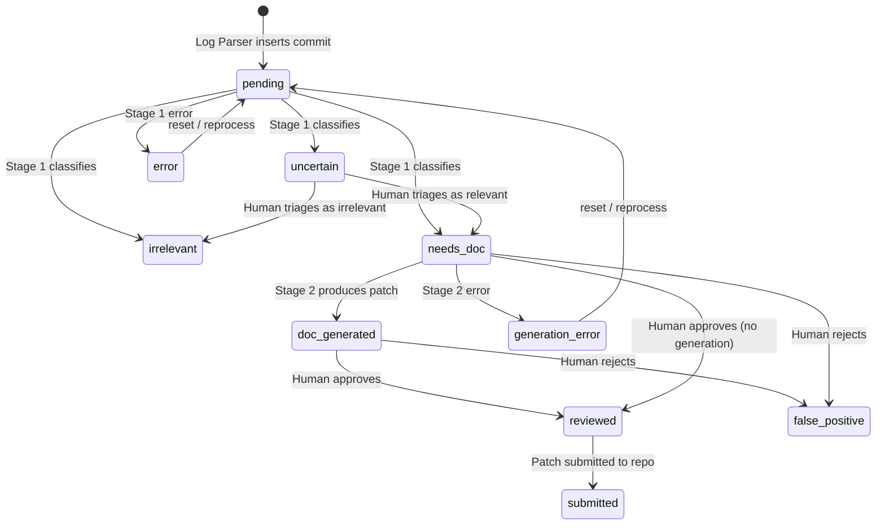
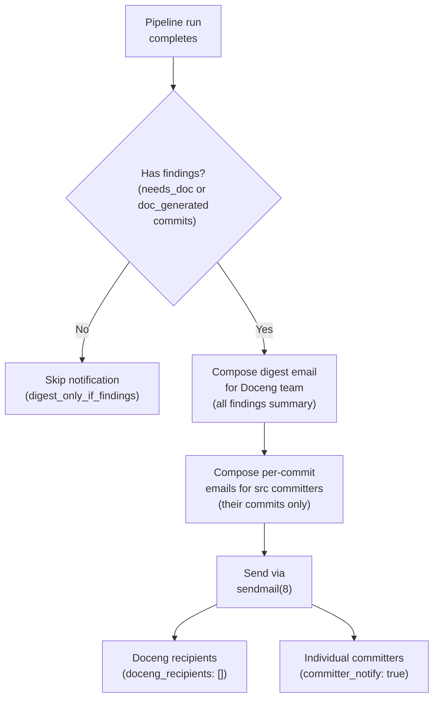
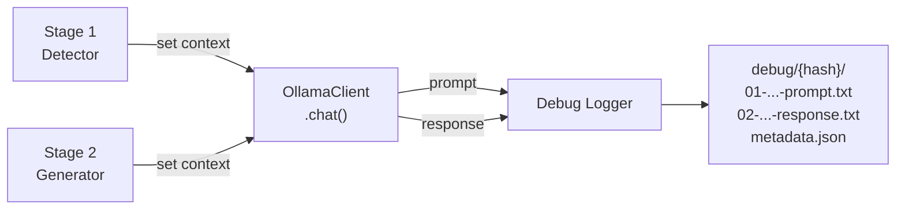
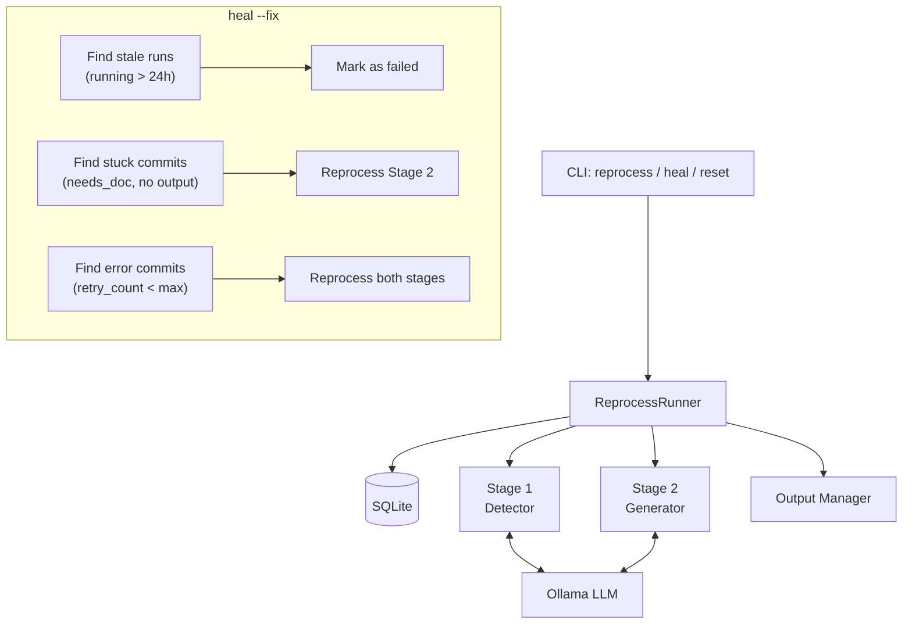
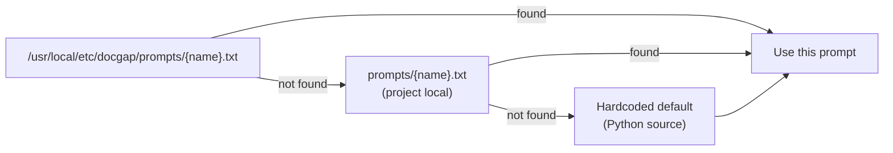
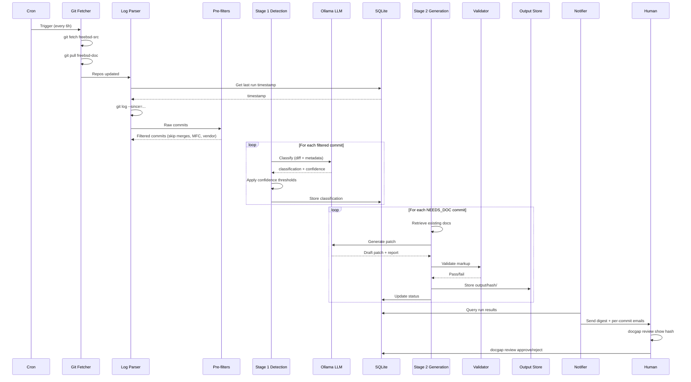

# FreeBSD Documentation Gap Detector — System Architecture

**Project codename:** docgap
**Version:** 0.1.6
**Date:** 2026-04-03
**Author:** Edson Brandi

---

## 1. System Overview

docgap is a batch-processing pipeline that monitors the FreeBSD source repository for commits requiring documentation updates, and generates standards-compliant draft patches for human review.



---

## 2. Component Descriptions

### 2.1 Git Fetcher

**Responsibility:** Maintain an up-to-date local clone of freebsd-src and freebsd-doc.

**Implementation:**
```bash
# Runs at the start of each cron cycle
git -C /var/db/docgap/repos/freebsd-src fetch --all --prune
git -C /var/db/docgap/repos/freebsd-doc pull --ff-only
```

**Key details:**
- freebsd-src is fetched (not pulled) — we read from remote tracking branches without modifying the working tree
- freebsd-doc is pulled to keep the working tree current for documentation lookups
- Both repos are cloned once during initial setup; subsequent runs only fetch deltas

### 2.2 Log Parser

**Responsibility:** Extract new commits since the last successful run and produce structured commit metadata.

**Implementation:**
```bash
# Get the timestamp of the last successful run from SQLite
LAST_RUN=$(sqlite3 /var/db/docgap/docgap.sqlite \
  "SELECT finished_at FROM runs WHERE status='completed' ORDER BY id DESC LIMIT 1")

# Extract commits since then
git -C /var/db/docgap/repos/freebsd-src log \
  --since="$LAST_RUN" \
  --format='%H|%an|%ae|%aI|%s' \
  --name-only \
  origin/main
```

**Output per commit:**
```json
{
  "hash": "abc1234def5678...",
  "author": "someone",
  "email": "someone@FreeBSD.org",
  "date": "2026-04-03T14:22:00+00:00",
  "subject": "Add -J flag to jot(1) for JSON output",
  "files": ["usr.bin/jot/jot.c", "usr.bin/jot/jot.1"]
}
```

**Pre-filter rules (no LLM needed):**
Skip commits that are definitively not documentation-relevant:
- Merge commits (subject starts with "Merge" or has >1 parent)
- Vendor imports (path starts with `contrib/` or `sys/contrib/`)
- MFC (Merge From Current) commits to stable branches (subject contains "MFC" or "MFS")
- Commits that only touch `Makefile`, `.gitignore`, `UPDATING`, or `ObsoleteFiles.inc`
- Commits by known bots

These heuristic filters reduce LLM calls by ~40-60% based on typical FreeBSD commit patterns.



### 2.3 Stage 1: Detection (LLM)

**Responsibility:** Classify each commit as `irrelevant`, `needs_doc`, or `uncertain`.

**Input context (per commit):**
| Component | Source |
|-----------|--------|
| Commit metadata | Log Parser output |
| Full diff | `git diff <hash>^..<hash>` |
| File list with paths | From commit |

**Estimated context size:** 5k-25k tokens per commit.

**System prompt (abbreviated):**

```
You are a FreeBSD documentation triage specialist. Your job is to determine
whether a source code commit requires an update to FreeBSD's official
documentation (manpages, handbook, or other FDP-maintained documents).

Classify the commit as one of:
- NEEDS_DOC: The commit introduces or changes user-visible behavior that
  should be documented. Examples: new command flags, new syscalls, changed
  defaults, new sysctl knobs, new commands/daemons, changed output formats.
- IRRELEVANT: The commit does not affect user-visible behavior. Examples:
  internal refactoring, code style changes, compiler warning fixes,
  performance optimizations with no behavioral change, test additions.
- UNCERTAIN: You cannot confidently determine whether documentation is needed.

Respond with a JSON object:
{
  "classification": "NEEDS_DOC" | "IRRELEVANT" | "UNCERTAIN",
  "confidence": 0.0-1.0,
  "category": "new_flag" | "new_command" | "changed_default" | "new_syscall" |
               "new_sysctl" | "changed_output" | "new_ioctl" | "api_change" |
               "other" | null,
  "doc_target": "path/to/affected/manpage.N or handbook section" | null,
  "reasoning": "Brief explanation of why this classification was chosen"
}

IMPORTANT: When in doubt, classify as UNCERTAIN rather than NEEDS_DOC.
False positives damage trust. It is better to miss a change than to
incorrectly flag one.
```

**Confidence thresholds:**
- `confidence >= 0.80` → accept classification as-is
- `0.50 <= confidence < 0.80` → override to `UNCERTAIN` regardless of classification
- `confidence < 0.50` → override to `IRRELEVANT` (model is guessing)



### 2.4 Stage 2: Generation (LLM)

**Responsibility:** Produce a draft documentation patch for commits classified as `needs_doc`.

**Input context:**

| Component | Tokens (est.) | Source |
|-----------|--------------|--------|
| System prompt + FDP Primer conventions | ~15k | Static, cached |
| mdoc(7) or AsciiDoc reference + examples | ~5k | Static, selected by doc_target type |
| Commit diff | ~2k-20k | `git diff` |
| Existing documentation for affected component | ~2k-30k | Path-based retrieval (ADR-004) |
| Stage 1 classification + reasoning | ~0.5k | SQLite |
| **Total** | **~25k-70k** | Well within 512k |

**Output:** A unified diff (patch) against the documentation file, plus a human-readable summary.

**Output structure:**
```
/var/db/docgap/output/<commit-hash>/
├── report.txt          # Human-readable analysis
├── manpage.patch       # Patch against the mdoc file (if applicable)
├── handbook.patch      # Patch against AsciiDoc file (if applicable)
└── metadata.json       # Machine-readable classification + generation metadata
```

**Validation step:** Before storing output, run:
- `mandoc -Tlint` on generated mdoc content to catch markup errors
- `asciidoctor --safe -o /dev/null` on generated AsciiDoc to catch syntax errors
- If validation fails, store the output with a `validation_failed` flag and include the error in the report

**Documentation retrieval strategy (ADR-004):**



### 2.5 SQLite Database

See ADR-002 for full schema. The database serves three roles:

1. **State machine** — tracks each commit through the pipeline stages
2. **Handoff mechanism** — Stage 1 writes, Stage 2 reads
3. **Reporting store** — powers the CLI and email reports

**State transitions:**



### 2.6 Notifier

See ADR-006. Sends email via local sendmail(8) at the end of each cron run if there are findings.



### 2.7 CLI (`docgap`)

A Python CLI tool for human interaction with the system.

```
docgap status                          # Show pipeline health and last run stats
docgap log [--since DATE] [--status S] # Query analyzed commits
docgap review list                     # List commits awaiting review
docgap review show <hash>              # Display report + patch for a commit
docgap review approve <hash>           # Mark as reviewed, optionally submit
docgap review reject <hash> --reason   # Mark as false positive with feedback
docgap report [--format txt|json]      # Generate summary report
docgap run                             # Manually trigger a pipeline run
docgap config show                     # Display current configuration
docgap reprocess <hash> [--failed|--pending]  # Retry failed/incomplete commits
docgap heal [--fix]                    # Detect and repair pipeline issues
docgap validate                        # Check system integrity
docgap reset <hash>                    # Reset commit to pending
docgap purge --before DATE             # Clean old data
```

### 2.8 LLM Debug Logger

**Responsibility:** Capture all LLM prompts and responses to disk for debugging and cross-model comparison.

**Implementation:** When `debug.llm_logging` is enabled in config, each LLM call is intercepted and saved:

```
/var/db/docgap/debug/<commit-hash>/
├── 01-stage1-detection-prompt.txt
├── 02-stage1-detection-response.txt
├── 03-stage2-generation-prompt.txt
├── 04-stage2-generation-response.txt
└── metadata.json
```

**Key details:**
- Files are numbered sequentially to preserve pipeline execution order
- Atomic writes (temp file + rename) prevent corruption on crash
- On re-run of the same commit, existing debug dir is renamed to `{hash}.v{N}/`
- Automatic rotation when entries exceed `max_debug_entries`
- `metadata.json` includes model name, config snapshot, and timestamps for cross-model evaluation



### 2.9 Reprocess Runner

**Responsibility:** Retry failed or interrupted commits through Stage 1 and/or Stage 2.

**Key details:**
- Reuses `Stage1Detector` and `Stage2Generator` from the main pipeline
- Operates on commits already in the database (not freshly parsed from git log)
- Creates audit run records with `status='reprocess'` for traceability
- Tracks `retry_count` per commit to prevent infinite retry loops
- Powers the `reprocess`, `heal`, and `reset` CLI commands



### 2.10 Prompt Templates

**Responsibility:** Provide LLM system prompts for Stage 1 detection and Stage 2 generation.

**Fallback chain:**



| Template | Stage | Purpose |
|----------|-------|---------|
| `detection.txt` | Stage 1 | Classify commits as NEEDS_DOC / IRRELEVANT / UNCERTAIN |
| `generation-mdoc.txt` | Stage 2 | Generate mdoc(7) manpage patches |
| `generation-asciidoc.txt` | Stage 2 | Generate AsciiDoc handbook/article patches |

The `/usr/local/etc/docgap/prompts/` directory is created empty by the install script. This is intentional — the system works out of the box with hardcoded defaults. To customize a prompt, drop a `.txt` file with the matching name into that directory.

---

## 3. Data Flow — Complete Pipeline Sequence



---

## 4. Directory Layout

```
/var/db/docgap/                        # Runtime data root
├── docgap.sqlite                      # State database
├── repos/                             # Local repository clones
│   ├── freebsd-src/                   # Bare-ish clone (fetch only)
│   └── freebsd-doc/                   # Working tree clone (pull)
├── output/                            # Generated artifacts per commit
│   └── <commit-hash>/
│       ├── report.txt
│       ├── manpage.patch
│       ├── handbook.patch
│       └── metadata.json
├── debug/                             # LLM debug logs (optional)
│   └── <commit-hash>/
│       ├── 01-stage1-detection-prompt.txt
│       ├── 02-stage1-detection-response.txt
│       ├── 03-stage2-generation-prompt.txt
│       ├── 04-stage2-generation-response.txt
│       └── metadata.json
├── reports/                           # Per-run aggregate reports
│   └── run-<id>.txt
└── logs/                              # Pipeline execution logs
    └── run-<id>.log

/usr/local/etc/docgap/                 # Configuration
├── config.yaml                        # Main configuration
└── prompts/                           # LLM prompt templates
    ├── detection.txt                  # Stage 1 system prompt
    ├── generation-mdoc.txt            # Stage 2 prompt for manpage generation
    ├── generation-asciidoc.txt        # Stage 2 prompt for handbook generation
    └── fdp-primer-excerpt.txt         # Cached FDP Primer conventions

/usr/local/bin/docgap                  # CLI entry point
/usr/local/lib/docgap/                 # Python package
```

---

## 5. Configuration

```yaml
# /usr/local/etc/docgap/config.yaml

general:
  data_dir: /var/db/docgap
  log_level: info                      # debug, info, warning, error

repositories:
  freebsd_src:
    path: /var/db/docgap/repos/freebsd-src
    remote: https://github.com/freebsd/freebsd-src.git
    branches:
      - main                           # Primary branch to monitor
      # - stable/14                    # Uncomment to monitor stable branches
  freebsd_doc:
    path: /var/db/docgap/repos/freebsd-doc
    remote: https://github.com/freebsd/freebsd-doc.git

llm:
  provider: ollama
  base_url: http://localhost:11434
  model: qwen3-coder-next-512k        # Or whatever model name Ollama uses
  temperature: 0.1                     # Low temperature for deterministic output
  max_context: 524288                  # 512k tokens

detection:
  confidence_threshold_accept: 0.80
  confidence_threshold_reject: 0.50
  skip_patterns:                       # Commit subject patterns to skip (regex)
    - "^Merge "
    - "^MFC "
    - "^MFS "
    - "^Revert "
  skip_paths:                          # File path prefixes to skip entirely
    - contrib/
    - sys/contrib/
    - .github/
  skip_files:                          # Specific filenames to skip
    - Makefile
    - .gitignore
    - UPDATING
    - ObsoleteFiles.inc

generation:
  validate_mdoc: true                  # Run mandoc -Tlint on generated mdoc
  validate_asciidoc: true              # Run asciidoctor --safe on generated AsciiDoc
  max_retries: 1                       # Retry generation once if validation fails

review:
  auto_submit:
    enabled: false
    hold_period_hours: 72
    categories:
      new_flag: false
      new_command: false
      changed_default: false
      new_syscall: false
      new_sysctl: false
      changed_output: false
      new_ioctl: false
      api_change: false

notification:
  doceng_recipients:
    - doceng@FreeBSD.org
  committer_notify: true
  digest_only_if_findings: true
  from_address: docgap@FreeBSD.org
  smtp_host: localhost

debug:
  llm_logging: false                   # Save LLM prompts/responses to disk
  # log_dir: /var/db/docgap/debug      # Defaults to {data_dir}/debug
  max_debug_entries: 500               # Rotate oldest when exceeded
  include_config_snapshot: true        # Include config in metadata.json
```

---

## 6. Deployment

### Initial Setup

```bash
# 1. Install dependencies
pkg install python311 py311-sqlite3 git ollama mandoc

# 2. Create runtime directories
mkdir -p /var/db/docgap/{repos,output,reports,logs}
mkdir -p /usr/local/etc/docgap/prompts

# 3. Clone repositories
git clone --bare https://github.com/freebsd/freebsd-src.git /var/db/docgap/repos/freebsd-src
git clone https://github.com/freebsd/freebsd-doc.git /var/db/docgap/repos/freebsd-doc

# 4. Initialize database
docgap init

# 5. Install configuration
cp config.yaml.sample /usr/local/etc/docgap/config.yaml
# Edit as needed

# 6. Ensure Ollama is running with the model loaded
ollama pull qwen3-coder-next-512k

# 7. Install cron job
echo "0 */6 * * * /usr/local/bin/docgap run >> /var/db/docgap/logs/cron.log 2>&1" \
  | crontab -
```

### Operational Commands

```bash
# Check system health
docgap status

# Manual run (useful for testing)
docgap run --dry-run          # Analyze but don't store results
docgap run                    # Full pipeline run
docgap run --since 2026-03-01 # Backfill from a specific date

# Monitor
tail -f /var/db/docgap/logs/run-*.log
```

---

## 7. Failure Modes and Recovery

| Failure | Detection | Recovery |
|---------|-----------|----------|
| Cron job doesn't fire | `docgap status` shows stale last-run timestamp | Run manually; check crontab |
| Git fetch fails (network) | Run log shows fetch error; run status = 'failed' | Next cron run retries automatically; commits accumulate and are processed in next batch |
| Ollama is down or model not loaded | LLM call timeout; run status = 'failed' | `ollama ps` to check; `ollama pull` to reload; next cron run retries |
| LLM returns malformed JSON | Stage 1/2 catches parse error; commit marked as 'uncertain' | Human triages; malformed responses are logged for prompt debugging |
| mandoc/asciidoctor validation fails | Output stored with `validation_failed` flag | Human reviews raw output; generation prompt may need tuning |
| SQLite corruption | Pipeline crashes on DB access | Restore from backup (`cp` the .sqlite file); re-run from last known good state |
| Disk full | Write failures in output/ or logs/ | Alert via cron error email; clean old output; increase disk |
| VRAM exhaustion | Ollama OOM; inference fails | Check with `rocm-smi`; reduce context size or restart Ollama |
| Pipeline crashes mid-Stage 2 | Commits stuck in `needs_doc` with no output | `docgap heal --fix` detects and reprocesses; or `docgap reprocess --pending` |
| Repeated Stage 1/2 errors | Commits with `error` or `generation_error` status | `docgap reprocess --failed`; `retry_count` prevents infinite loops |
| Stale run records | Run stuck in `running` status > 24h | `docgap heal --fix` marks as failed |

---

## 8. Security Considerations

1. **No secrets in the pipeline.** The system reads public repositories and generates documentation. No credentials, API keys, or private data flows through the LLM.

2. **Local-only inference.** No source code or documentation is sent to external services. The LLM runs on the same machine via Ollama.

3. **Email spoofing.** The `from_address` should be a real address that Doceng controls. Configure SPF/DKIM if the machine sends to external recipients.

4. **No write access to repositories.** The system only reads freebsd-src and freebsd-doc. It never pushes. Patch submission is a manual human action via the CLI.

5. **SQLite file permissions.** The database should be readable/writable only by the docgap service user: `chmod 600 /var/db/docgap/docgap.sqlite`.

---

## 9. Observability

| Metric | Source | Alert Threshold |
|--------|--------|-----------------|
| Last successful run timestamp | `runs` table | > 12 hours ago |
| Commits pending analysis | `commits` table WHERE status='pending' | > 100 (backlog growing) |
| False positive rate (30-day rolling) | `commits` table WHERE status='false_positive' | > 15% of flagged commits |
| Average detection confidence | `commits` table AVG(confidence) | < 0.70 (model may be degrading) |
| LLM inference time per commit | Run logs | > 5 minutes per commit (model may be struggling) |
| Disk usage in output/ | `du -sh` | > 10 GB |

All metrics are queryable via `docgap status --verbose` or directly from SQLite.

---

## 11. Implicit Behaviors and Defaults

The following behaviors are built into the pipeline and affect operation without explicit configuration:

| Behavior | Details | Impact |
|----------|---------|--------|
| **First run default** | Processes last 7 days of commits when no prior run exists | May process more or fewer commits than expected |
| **Auto-resume** | Uses `finished_at` from last successful run as start point | Commits from before the last run are never re-analyzed |
| **Skip duplicates** | Commits already in the database are silently skipped | Interrupted runs resume without re-processing |
| **Error → UNCERTAIN** | LLM failures produce `UNCERTAIN` classification with confidence 0.0 | Pipeline keeps running; errors may be hidden |
| **Placeholder patches** | Failed generation produces `TODO` comment patch, marked as `doc_generated` | Requires careful review of generated output |
| **Diff truncation** | Diffs > 100K chars are truncated before LLM call | Large commits may be classified on incomplete data |
| **Format fallback** | Unknown `doc_target` paths default to mdoc(7) format | AsciiDoc targets must match known extensions |
| **Doc retrieval** | Path mapping → keyword search → no context (three-level fallback) | Generated patches without doc context may be lower quality |
| **init is destructive** | `docgap init` deletes existing database before recreating | Always backup before running init with existing data |
| **Git retry** | Failed git commands retry 3x with exponential backoff | Operations may take up to 3x the configured timeout |
| **Config search order** | `/usr/local/etc/docgap/config.yaml` → `/etc/docgap/config.yaml` → `config/config.yaml` | First file found wins |
| **Prompt search order** | System `/usr/local/etc/docgap/prompts/` → project `prompts/` → hardcoded default | System overrides always take precedence |

---

## 12. Technology Stack Summary

| Component | Technology | Rationale |
|-----------|-----------|-----------|
| Language | Python 3.11+ | Stdlib sqlite3, smtplib, subprocess; rich ecosystem; Doceng familiarity |
| LLM Runtime | Ollama | Local inference; simple API; model management; FreeBSD compatible |
| LLM Model | Qwen 3 Next Coder (512k) | Fits in 96 GB VRAM; large context; strong code understanding |
| Database | SQLite | Zero-server; ACID; SQL queries; Python stdlib |
| Notification | sendmail(8) | Native FreeBSD; zero dependencies |
| Validation | mandoc(1), asciidoctor | Native FreeBSD tools for markup validation |
| Orchestration | cron(8) | Native FreeBSD; simplest possible scheduling |
| VCS | git(1) | FreeBSD's VCS; direct repo access |
| Configuration | YAML | Human-readable; Python `pyyaml` is the only external dependency |

**External Python dependencies:** `pyyaml`, `requests` (for Ollama HTTP API). That's it.
